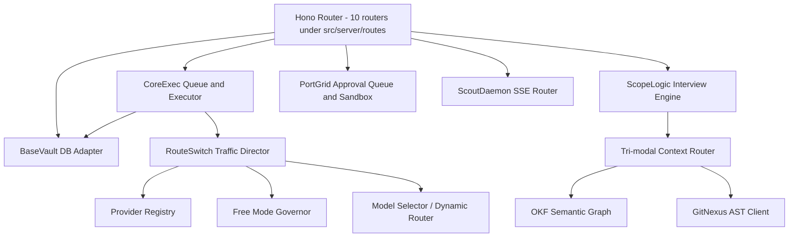

# C4 Component View

## Component Diagram

## Key Components

- **CoreExec:** state machine executing workflow DAG tasks, with
  `resumeInProgressRuns()` for crash recovery.
- **RouteSwitch:** Provider Registry + Free Mode Governor (paid-provider
  lock) + Model Selector (`src/core/routeswitch/model-selector/`) +
  fallback/council logic.
- **BaseVault:** DB adapter, migrations, `SensitiveDataRedactor`.
- **ScopeLogic:** bounded interview engine producing draft DAGs with numeric
  confidence.
- **PortGrid:** `CommandSandbox` allowlist for the general command path, plus
  the one sandboxed exception (embedded terminal).
- **Context Router:** picks the right memory store (OKF graph, GitNexus AST,
  or knowledge graph) per query; degrades silently if the `gitnexus` CLI
  isn't installed.
