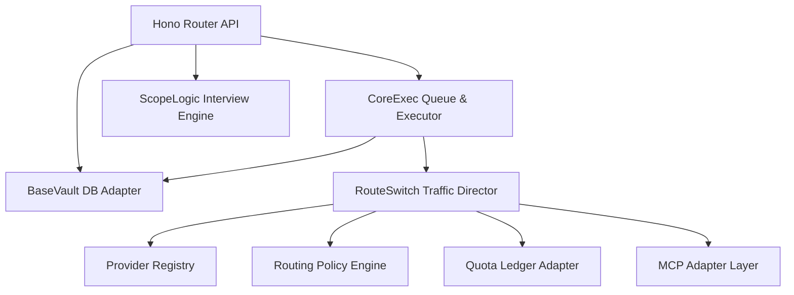

# C4 Component View

## Component Diagram

## Key Components

- **CoreExec:** Asymmetric state machine executing workflow DAG tasks.
- **RouteSwitch:** Composed of the Provider Registry, Routing Policy Engine, Quota Ledger, and MCP Adapter to manage model and tool routing.
- **BaseVault:** DB adapter managing read-write SQLite locks.
- **ScopeLogic:** Bounded interview logic creating draft DAG layouts.
