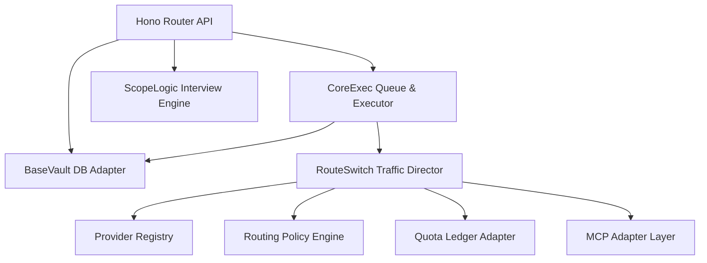

**Document Summary: C4 Component View**

```mermaid
graph TD
    API[Hono Router API] --> CoreExec[CoreExec Queue & Executor]
    API --> ScopeLogic[ScopeLogic Interview Engine]
    API --> BaseVault[BaseVault DB Adapter]
    CoreExec --> BaseVault
    CoreExec --> RouteSwitch[RouteSwitch Traffic Director]
    RouteSwitch --> ProviderReg[Provider Registry]
    RouteSwitch --> PolicyEngine[Routing Policy Engine]
    RouteSwitch --> QuotaLedger[Quota Ledger Adapter]
    RouteSwitch --> MCPAdapter[MCP Adapter Layer]
```

===

<!-- Append-only log of changes managed by BaseVault -->
