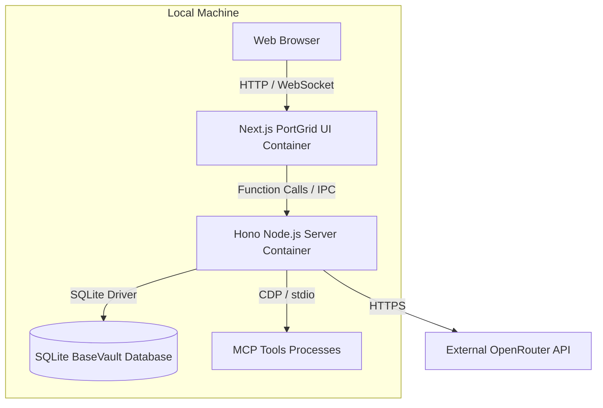

# C4 Container View

## Container Diagram

## Containers

- **Web Browser:** Renders the PortGrid cockpit dashboard.
- **Next.js PortGrid UI:** Desktop-shell dashboard using xyflow for DAG layouts.
- **Hono Node.js Server:** Main backend process hosting CoreExec, BaseVault, RouteSwitch.
- **SQLite Database:** Local persistent database file.
