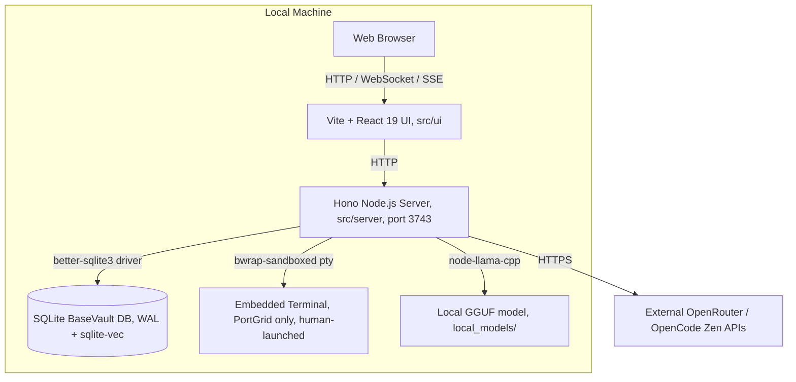

# C4 Container View

## Container Diagram

## Containers

- **Web Browser:** renders the dashboard suite (PortGrid, CoreExec,
  ScopeLogic, RouteSwitch, BaseVault, ScoutDaemon, CerebroDashboard,
  UnifiedMasterDashboard).
- **Vite + React 19 UI:** `src/ui/main.tsx` → `OSLayout` → one of 8
  `*Dashboard.tsx` views inside a shared `AppShell`. Built with `vite build`,
  served statically in production.
- **Hono Node.js Server:** single process hosting all 6 module backends plus
  the SSE scout router and the WebSocket terminal endpoint
  (`/api/portgrid/terminal/:projectId`).
- **SQLite Database:** local persistent file, ~16 tables (see
  `data-architecture.md`).
- **Embedded Terminal:** the one deliberate exception to the
  no-shell-escape-hatch rule — sandboxed by directory+network containment
  (`--ro-bind`, single project `--bind`, `--unshare-net`, `--clearenv`), never
  auto-opened by an agent.
