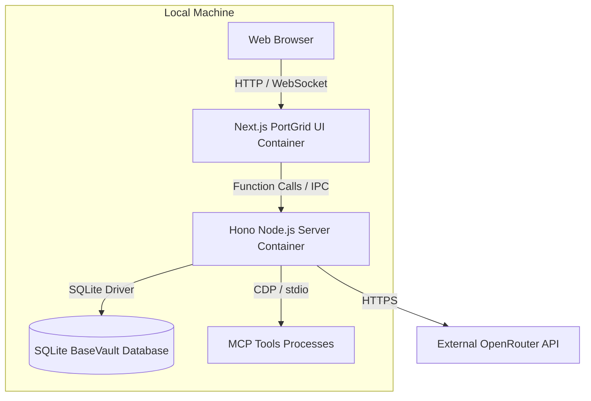

**Document Summary: C4 Container View**

```mermaid
graph TB
    subgraph Local Machine
        Browser[Web Browser] -->|HTTP / WebSocket| UI[Next.js PortGrid UI Container]
        UI -->|Function Calls / IPC| Server[Hono Node.js Server Container]
        Server -->|SQLite Driver| DB[(SQLite BaseVault Database)]
        Server -->|CDP / stdio| MCP[MCP Tools Processes]
    end
    Server -->|HTTPS| OpenRouter[External OpenRouter API]
```

===

<!-- Append-only log of changes managed by BaseVault -->
