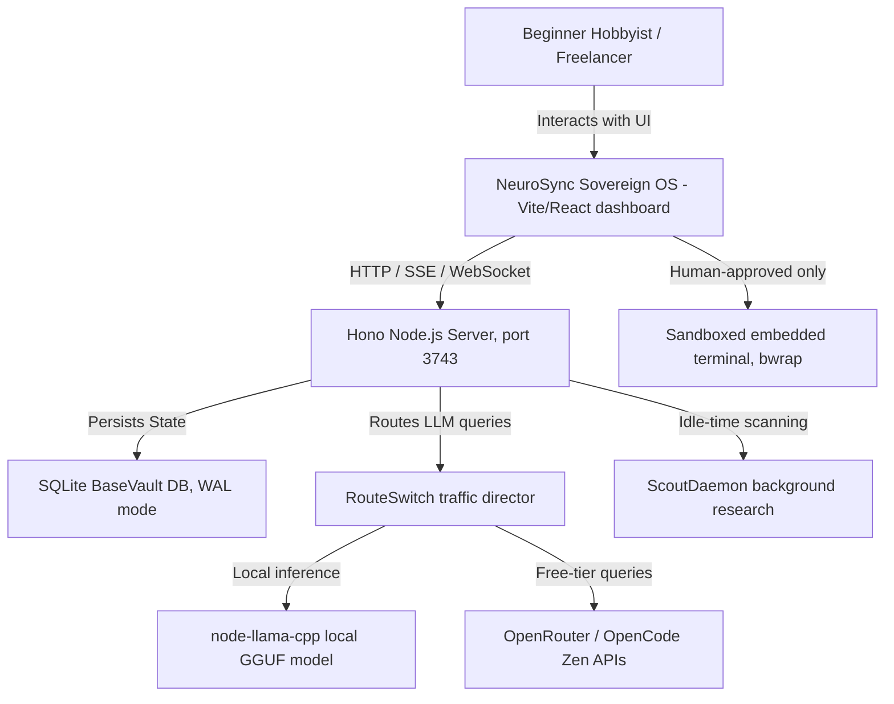

# C4 System Context

## System Context Diagram

## System Elements

- **User:** solo developer/operator managing multi-project AI workflows
  locally.
- **Dashboards:** React 19 + `@xyflow/react` frontend, 8 `*Dashboard.tsx`
  views hosted in a shared `AppShell` (top bar, sidebar, developer-mode
  toggle, theme toggle, project filter). No Next.js involved anywhere.
- **Hono Server:** single Node process, CORS-wide-open by design (local-only
  tool), 64KB payload limit, 120 req/min per-IP rate limit (exempts `/health`
  and `/api/config`).
- **BaseVault DB:** local SQLite instance containing all runs, memory, and
  logs — see `docs/docs/02-architecture/data-architecture.md`.
- **RouteSwitch:** deterministic traffic router enforcing Free Mode Governor
  limits; supports both local GGUF inference and outbound free-tier APIs.
