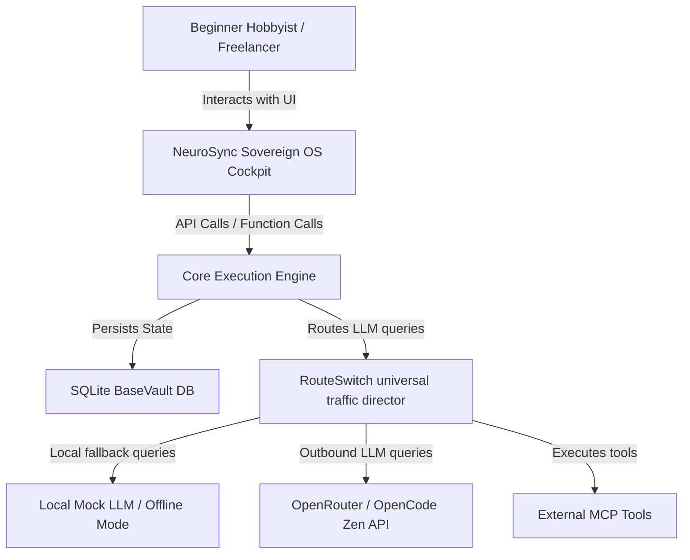

# C4 System Context

## System Context Diagram

## System Elements

- **User:** Manages client work and executes AI workflow tasks locally.
- **NeuroSync Cockpit:** The Next.js dashboard providing visual approval queues and Local Proof Badges.
- **CoreExec Engine:** Orchestrates transactional execution of DAGs.
- **BaseVault DB:** Local SQLite instance containing all runs, memory, and logs.
- **RouteSwitch:** Deterministic traffic router enforcing Free Mode limits.
