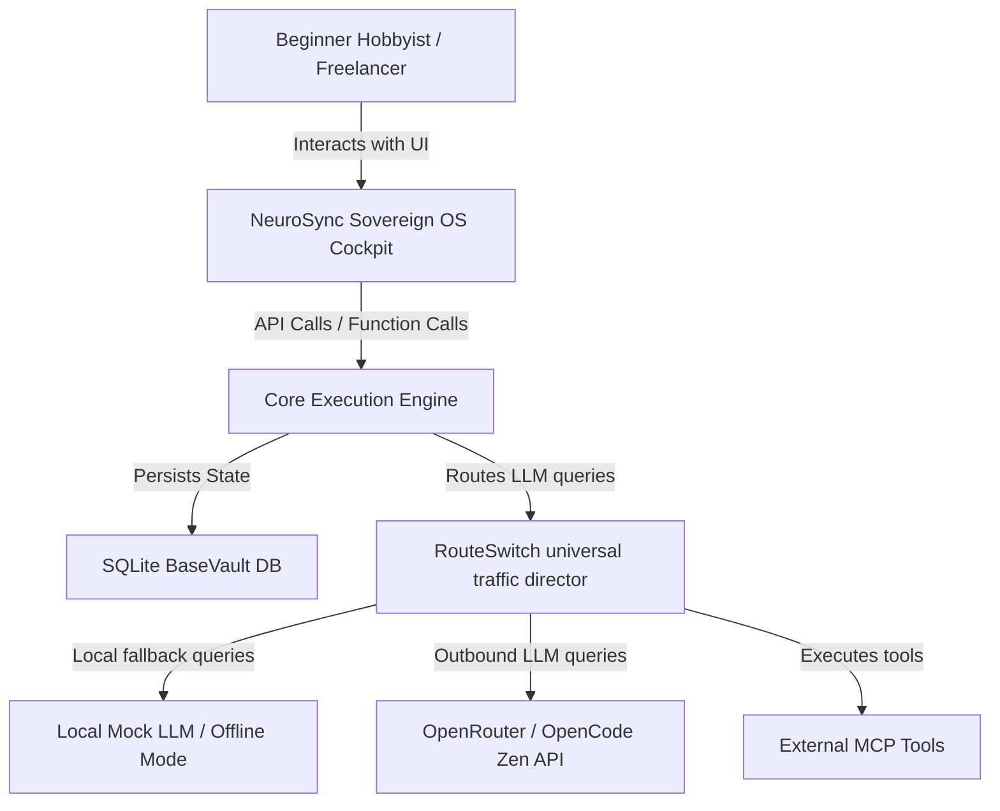

**Document Summary: C4 System Context**

```mermaid
graph TD
    User[Beginner Hobbyist / Freelancer] -->|Interacts with UI| PortGrid[NeuroSync Sovereign OS Cockpit]
    PortGrid -->|API Calls / Function Calls| CoreExec[Core Execution Engine]
    CoreExec -->|Persists State| BaseVault[SQLite BaseVault DB]
    CoreExec -->|Routes LLM queries| RouteSwitch[RouteSwitch universal traffic director]
    RouteSwitch -->|Local fallback queries| MockProvider[Local Mock LLM / Offline Mode]
    RouteSwitch -->|Outbound LLM queries| OpenRouter[OpenRouter / OpenCode Zen API]
    RouteSwitch -->|Executes tools| MCP[External MCP Tools]
```

===

<!-- Append-only log of changes managed by BaseVault -->
