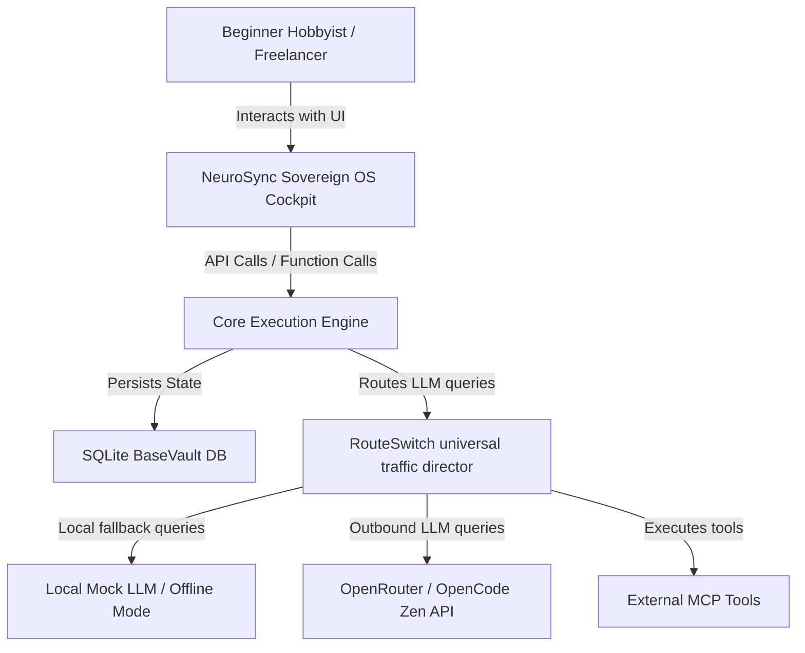

**Document Summary: C4 System Context**

===

<!-- Append-only log of changes managed by BaseVault -->

**Date:** 2026-06-26
**Agent:** Maintenance Agent (Antigravity)

- System-wide TypeScript type resolution completed.
- Backend type errors (165 tests) passing and cleared.
- Successfully bootstrapped missing dependencies in Next.js `ui-next` directory.
- Root TSConfig optimized for monorepo separation.
- Unfinished tasks in `ts-errors.txt` successfully verified and marked as complete.

### [2026-06-26] UI Overhaul - Full Dashboard Suite Redesign Complete
- Fully redesigned and refactored **BaseVault**, **PortGrid**, **ScopeLogic**, **CoreExec**, **RouteSwitch**, **ScoutDaemon**, and **Cerebro** dashboards.
- Applied the "Grit, Not Grime" zero-budget, high-reliability local execution design philosophy.
- Transitioned to "High-Glow" dynamic themes tailored to each module's core function.
- Finalized global styling variables in `index.css`.
- Synchronized all module routes inside `OSLayout.tsx` and `App.tsx` ensuring 100% cohesion across the suite.
