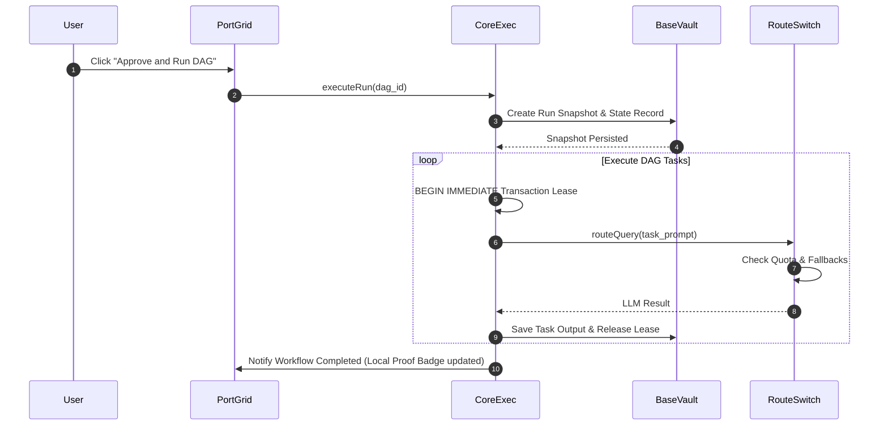

# Runtime Flows

## Standard Execution Sequence

## Restart Recovery Flow

If the system crashes during execution:
1. On boot, CoreExec queries BaseVault for runs marked `running`.
2. It expires any stale task leases.
3. Eligible tasks are requeued.
4. Finished tasks retrieve results from BaseVault, resuming the DAG without duplicating external side effects.
