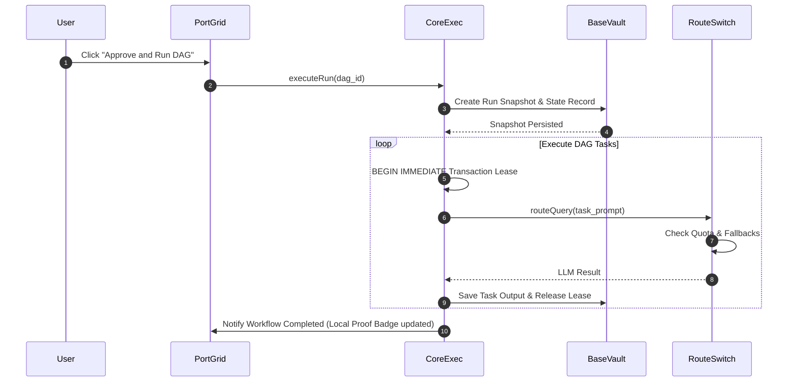

**Document Summary: Runtime Flows**

```mermaid
sequenceDiagram
    autonumber
    User->>PortGrid: Click "Approve and Run DAG"
    PortGrid->>CoreExec: executeRun(dag_id)
    CoreExec->>BaseVault: Create Run Snapshot & State Record
    BaseVault-->>CoreExec: Snapshot Persisted
    loop Execute DAG Tasks
        CoreExec->>CoreExec: BEGIN IMMEDIATE Transaction Lease
        CoreExec->>RouteSwitch: routeQuery(task_prompt)
        RouteSwitch->>RouteSwitch: Check Quota & Fallbacks
        RouteSwitch-->>CoreExec: LLM Result
        CoreExec->>BaseVault: Save Task Output & Release Lease
    end
    CoreExec->>PortGrid: Notify Workflow Completed (Local Proof Badge updated)
```

===

<!-- Append-only log of changes managed by BaseVault -->
